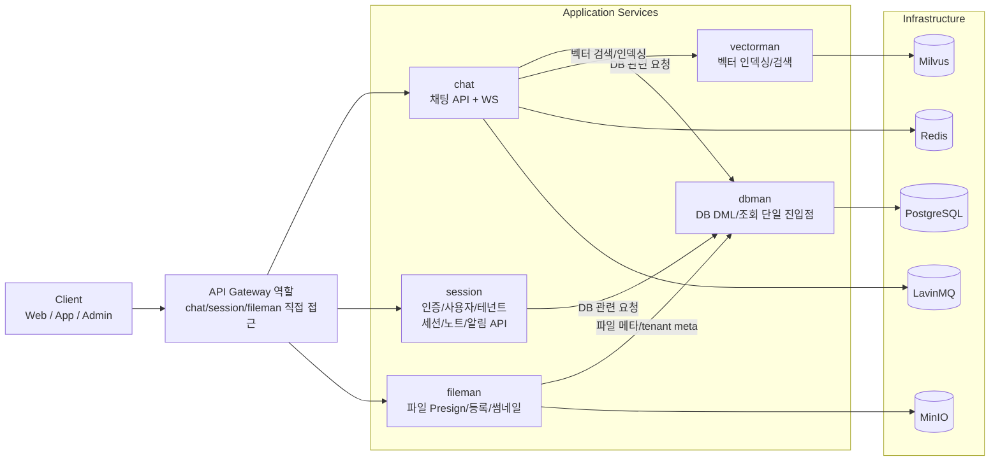
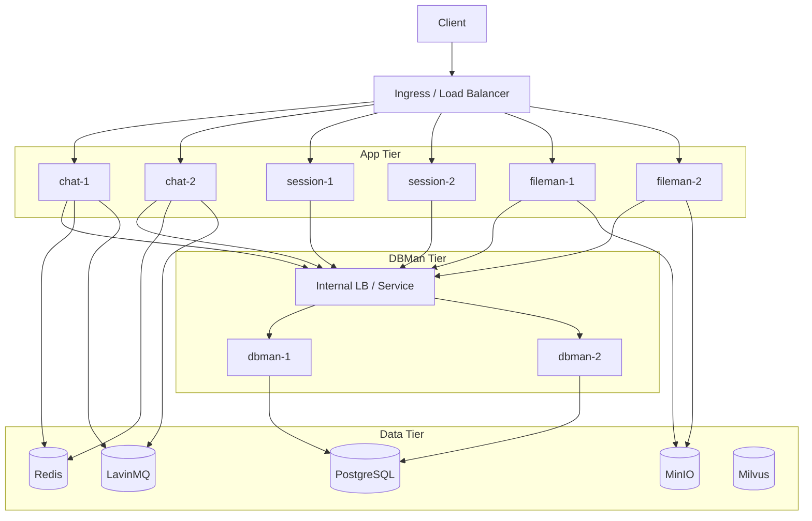
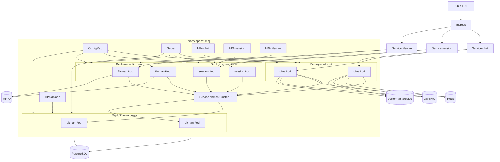

# 아키텍처 구성도

## 전체 구성



## 책임 경계

- dbman: 모든 핵심 DB DML/조회 책임 집중
- chat: 실시간 채팅/WS 중심, DB 작업은 dbman 위임
- session: 인증/사용자/테넌트 + 세션/노트/알림 API, DB 작업은 dbman 위임
- fileman: MinIO 업로드/다운로드/썸네일, 파일 메타는 dbman 위임
- vectorman: 벡터 인덱싱/검색 처리

## 운영 포인트

- liveness/readiness:
  - dbman: /health/live, /health/ready
  - 공통 호환: /health
- dbman 클라이언트:
  - 다중 endpoint 지원(DBMAN_ENDPOINTS)
  - 연속 실패 임계치 + cooldown 기반 endpoint 임시 제외

## 배포 관점(HA)



### HA 체크포인트

- dbman readiness(`/health/ready`) 실패 시 LB에서 즉시 제외
- 앱 서비스는 `DBMAN_ENDPOINTS` 다중 endpoint로 failover 가능
- dbman 단일 노드 장애 시에도 서비스 지속(다른 endpoint 정상 가정)
- 타임아웃/실패 임계치/cooldown 값은 환경변수로 운영 중 조정 가능

## Kubernetes 매핑



### Kubernetes 체크리스트

- Ingress health check는 앱별 기본 health와 dbman ready를 분리 사용
- dbman Pod에는 readiness probe를 /health/ready로 설정
- chat, session, fileman에는 DBMAN_ENDPOINTS를 Service DNS 또는 내부 LB로 주입
- ConfigMap에는 비민감 변수, Secret에는 JWT/접속키를 분리 저장
- HPA 기준은 CPU + 지연시간/요청량 지표를 함께 사용

## 멀티테넌트 인프라 분기(Shared vs Dedicated)

```mermaid
flowchart TB
    subgraph Clients
      U1[Tenant A Users]
      U2[Tenant B Users]
      U3[Tenant X Users]
    end

    U1 --> LB[Ingress / Load Balancer]
    U2 --> LB
    U3 --> LB

    LB --> CHAT1[chat-1]
    LB --> CHAT2[chat-2]

    subgraph Shared Infra
      RSH[(Shared Redis)]
      MQSH[(Shared LavinMQ)]
      DBSH[(Shared PostgreSQL)]
    end

    subgraph Dedicated Infra for Tenant X
      RX[(Redis X)]
      MQX[(LavinMQ X)]
      DBX[(PostgreSQL X)]
    end

    CHAT1 -->|tenant A/B realtime channel| RSH
    CHAT2 -->|tenant A/B realtime channel| RSH

    CHAT1 -->|tenant X realtime channel| RX
    CHAT2 -->|tenant X realtime channel| RX

    CHAT1 --> DBMAN[dbman]
    CHAT2 --> DBMAN

    DBMAN -->|tenant A/B queries| DBSH
    DBMAN -->|tenant X queries| DBX

    CHAT1 -->|tenant A/B event publish| MQSH
    CHAT2 -->|tenant A/B event publish| MQSH

    CHAT1 -->|tenant X event publish| MQX
    CHAT2 -->|tenant X event publish| MQX

    MQSH --> C1[Shared Consumers]
    MQX --> C2[Tenant X Consumers]

    RSH -. channel: tenant:{id}:room:{id} .- CHAT1
    MQSH -. routing key: tenantA.message.created .- CHAT1
    MQX -. routing key: tenantX.message.created .- CHAT2
```

### 분기 원칙

- Shared tenant는 공용 Redis/MQ/DB를 사용하고 tenant 식별자 기반으로 논리 분리
- Dedicated tenant는 tenant 메타 설정에 따라 전용 Redis/MQ/DB로 라우팅
- 실시간(WS)은 Redis 채널 분리, 비동기 이벤트는 MQ routing key 분리
